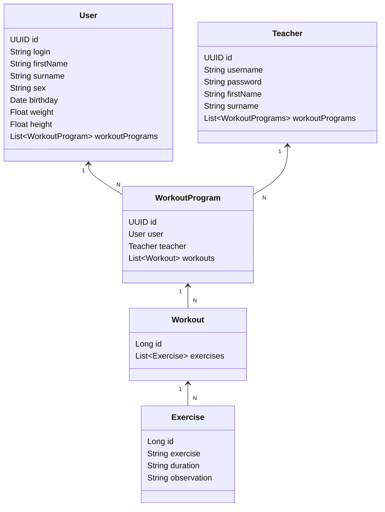

# Workout Management API
This is a Workout Management API where Teachers can create and assign Workout Programs
to other Users. Feel free to fork and contribute :D

## Technologies used: 
- Java 17
- Spring Boot
- Spring security
- JWT
- JUnit and Mockito
- PostgreSQL
- And hosted on Railway on: https://workout-management.up.railway.app

## API Endpoints documentation

https://documenter.getpostman.com/view/27378065/2s9YJdXNuj

## Installation

Java 17 JDK required.

1. Set your PostgreSQL database;

2. Install maven dependencies

3. Set the Environment Variables according to the application.yml 
(you can use ```ddl-auto: create``` on your first run, to automatically create the db tables. Then you can set it as ```validate``` again);

4. You will have to manually insert the first Teacher on database.

5. Run app at source folder with ```mvn spring-boot:run``` or run it through the IDE of your choice.

The API will be available at http://localhost:8080

## Class Diagram (API's domain)


