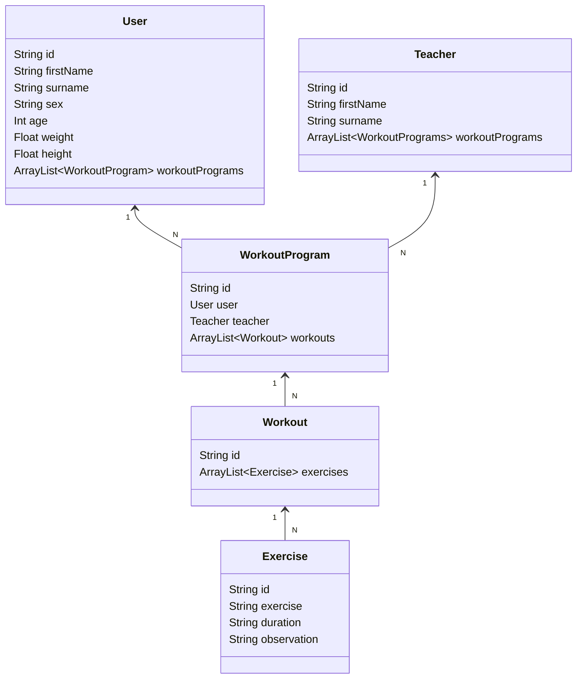

# Dio Santander Restful Api
Restful API developed for Santander's Java BackEnd Bootcamp.

## Class Diagram (API's domain)

```mermaid
 classDiagram
    User "1" <-- "N" WorkoutProgram
    Teacher "1" <-- "N" WorkoutProgram
    WorkoutProgram "1" <-- "N" Workout
    Workout "1" <-- "N" Exercise

    class User {
        String id
        String firstName
        String surname
        String sex
        Int age
        Float weight
        Float height
        ArrayList~WorkoutProgram~ workoutPrograms
    }
    class Teacher {
        String id
        String firstName
        String surname
        ArrayList~WorkoutPrograms~ workoutPrograms
    }
    class WorkoutProgram {
        String id
        User user
        Teacher teacher
        ArrayList~Workout~ workouts
    }
    class Workout {
        String id
        ArrayList~Exercise~ exercises
    }
    class Exercise {
        String id
        String exercise
        String duration
        String observation
    }
```
