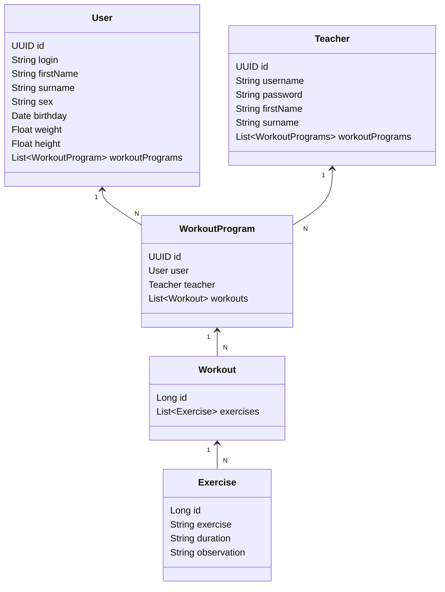

# Workout Management Api
Restful API developed for Santander's Java BackEnd Bootcamp.

This is a Workout Program Management API developed with: Java 17, Spring Boot and PostgreSQL and hosted on Railway.

Endpoints on: https://workout-management.up.railway.app

## Instalation

Java 17 JDK required.

1. Set your PostgreSQL database;

2. Install maven dependencies

3. Set the Enviromment Variables according to the application.yml (you can use ```ddl-auto: create``` on your first run, to automatically create the db tables. Then you can set it as 'validate' again);

4. Run app at source folder with ```mvn spring-boot:run``` or run it through the IDE of your choice.

The API will be available at http://localhost:8080

## Class Diagram (API's domain)


